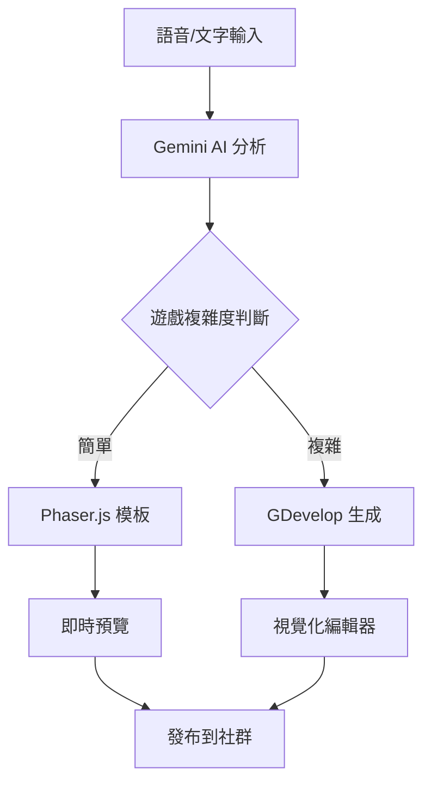

# FA-Game 開發規劃書 📋

## 願景
建立一個革命性的教育遊戲平台，讓父母能夠用最自然的方式（語音）為孩子創造個性化的教育遊戲。

## 技術架構演進路線圖

### 🚀 Phase 1: MVP 基礎建設（當前 - 3個月）
**目標**：快速推出可用產品，驗證核心概念

#### 核心功能
- ✅ 語音輸入轉遊戲
- ✅ Phaser.js 基礎遊戲模板（配對、排序）
- ✅ 社群分享功能
- ✅ Google 登入認證

#### 技術堆疊
```yaml
前端: Next.js 14 + TypeScript + Tailwind CSS
遊戲引擎: Phaser.js
AI: Gemini Pro 2.5
資料庫: PostgreSQL + Prisma
認證: NextAuth.js
部署: Vercel
```

#### 遊戲模板
1. **配對遊戲**：圖片、文字、聲音配對
2. **排序遊戲**：數字、大小、字母排序
3. **填色遊戲**：簡單的著色遊戲
4. **拼圖遊戲**：基礎拼圖功能

### 🔄 Phase 2: AI 智能提升（3-6個月）
**目標**：提升 AI 理解能力，支援更複雜的遊戲生成

#### 新增功能
- 🤖 AI 學習遊戲設計模式
- 📊 遊戲數據分析儀表板
- 💰 付費模板市集
- 🌍 多語言支援

#### AI 訓練計劃
```typescript
// 收集遊戲模式數據
const gamePatterns = {
  educational_goals: ["認知", "邏輯", "創意", "語言"],
  game_mechanics: ["拖放", "點擊", "繪畫", "選擇"],
  difficulty_levels: ["簡單", "中等", "困難"],
  age_adaptations: ["3-4歲", "5-6歲", "7-8歲"]
};

// Few-shot learning 範例
const trainingExamples = [
  {
    input: "製作認識形狀的遊戲",
    output: {
      template: "matching",
      content: ["圓形", "方形", "三角形"],
      difficulty: "easy",
      interactions: ["drag-drop", "audio-feedback"]
    }
  }
];
```

### 🎮 Phase 3: GDevelop 整合（6-9個月）
**目標**：支援更複雜的遊戲類型，提供視覺化編輯能力

#### 架構升級


#### GDevelop 整合功能
- 平台遊戲生成
- 物理模擬遊戲
- RPG 冒險遊戲
- 音樂節奏遊戲

### 🚀 Phase 4: 完整生態系統（9-12個月）
**目標**：建立完整的創作者經濟體系

#### 平台功能
1. **創作者工具**
   - 進階遊戲編輯器
   - 素材資源庫
   - 協作功能

2. **社群功能**
   - 遊戲評分系統
   - 創作者認證
   - 教育機構合作

3. **商業模式**
   - 訂閱制專業版
   - 模板交易市場
   - 廣告收益分享

## 技術實現細節

### AI 遊戲生成流程
```typescript
interface GameGenerationPipeline {
  // Step 1: 語音/文字輸入處理
  input: {
    type: 'voice' | 'text';
    content: string;
    language: string;
  };
  
  // Step 2: AI 意圖分析
  analysis: {
    gameType: string;
    educationalGoals: string[];
    ageGroup: string;
    complexity: 'simple' | 'medium' | 'complex';
  };
  
  // Step 3: 遊戲引擎選擇
  engineSelection: {
    simple: 'Phaser.js';
    complex: 'GDevelop';
  };
  
  // Step 4: 內容生成
  generation: {
    template: string;
    assets: Asset[];
    logic: GameLogic;
    config: GameConfig;
  };
  
  // Step 5: 輸出
  output: {
    preview: URL;
    editable: boolean;
    shareable: boolean;
  };
}
```

### 混合架構優勢
1. **靈活性**：根據需求選擇最適合的技術
2. **擴展性**：易於添加新的遊戲引擎
3. **效能**：簡單遊戲快速載入，複雜遊戲功能豐富
4. **成本效益**：按需使用資源

## 成功指標

### 短期目標（3個月）
- 日活躍用戶：1,000+
- 創建遊戲數：5,000+
- 用戶留存率：> 40%

### 中期目標（6個月）
- 日活躍用戶：10,000+
- 付費用戶：500+
- 模板交易量：100+/月

### 長期目標（12個月）
- 日活躍用戶：100,000+
- 付費用戶：5,000+
- 月收入：$50,000+

## 技術挑戰與解決方案

### 挑戰 1：AI 生成準確性
**解決方案**：
- 持續收集用戶反饋
- 建立遊戲模式資料庫
- 定期更新 AI 模型

### 挑戰 2：遊戲效能優化
**解決方案**：
- 使用 WebAssembly 加速
- 實施漸進式載入
- CDN 資源分發

### 挑戰 3：跨平台相容性
**解決方案**：
- PWA 技術支援
- React Native 手機版
- Electron 桌面版

## 團隊組建建議

1. **技術團隊**
   - 全端工程師 x 2
   - AI 工程師 x 1
   - 遊戲開發者 x 1

2. **產品團隊**
   - 產品經理 x 1
   - UI/UX 設計師 x 1

3. **營運團隊**
   - 社群經理 x 1
   - 客戶成功 x 1

## 下一步行動

1. **立即執行**
   - 完善 MVP 功能
   - 招募首批測試用戶
   - 建立反饋機制

2. **本月目標**
   - 發布 Beta 版本
   - 收集 100+ 用戶反饋
   - 優化核心體驗

3. **季度目標**
   - 正式上線
   - 實現基礎商業化
   - 拓展合作夥伴

---

**讓每個父母都成為孩子的遊戲設計師！** 🎮👨‍👩‍👧‍👦